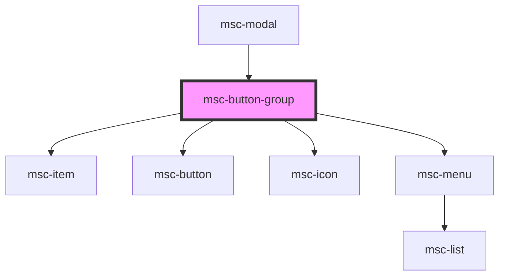

# msc-button-group

<!-- Auto Generated Below -->

## Properties

| Property        | Attribute  | Description                                                                                               | Type      | Default     |
| --------------- | ---------- | --------------------------------------------------------------------------------------------------------- | --------- | ----------- |
| `autohideItems` | `autohide` | Hide's the last X items that don't fit to the parent container. items will be re-rendered as <msc-item /> | `boolean` | `undefined` |

## Dependencies

### Used by

 - [msc-modal](../msc-modal)

### Depends on

- [msc-item](../msc-item)
- [msc-button](../msc-button)
- [msc-icon](../msc-icon)
- [msc-menu](../msc-menu)

### Graph

----------------------------------------------

*Built with [StencilJS](https://stenciljs.com/)*
