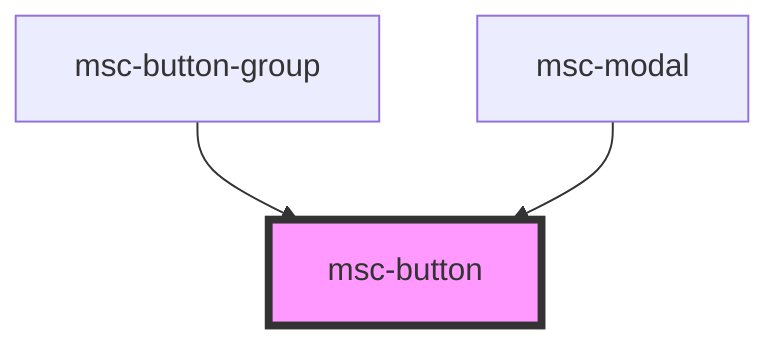

# msc-button

<!-- Auto Generated Below -->

## Properties

| Property   | Attribute  | Description                                                       | Type                                                      | Default     |
| ---------- | ---------- | ----------------------------------------------------------------- | --------------------------------------------------------- | ----------- |
| `disabled` | `disabled` | Wether or not the component is actually disabled.                 | `boolean`                                                 | `undefined` |
| `href`     | `to`       | Optional, if provided, the button contains an a11y-anchor inside. | `string`                                                  | `undefined` |
| `state`    | `state`    | What state the button has.                                        | `"bad" \| "good" \| "info" \| "normal" \| "warn"`         | `undefined` |
| `target`   | `target`   | If "to" is provided, should the link have a target be set?        | `string`                                                  | `'_self'`   |
| `theme`    | `theme`    | What kind of default-provided theme shall be applied.             | `"big" \| "default" \| "minimal" \| "primary" \| "small"` | `undefined` |
| `type`     | `type`     | What kind of button this one is.                                  | `string`                                                  | `undefined` |

## Dependencies

### Used by

 - [msc-button-group](../msc-button-group)
 - [msc-modal](../msc-modal)

### Graph

----------------------------------------------

*Built with [StencilJS](https://stenciljs.com/)*
