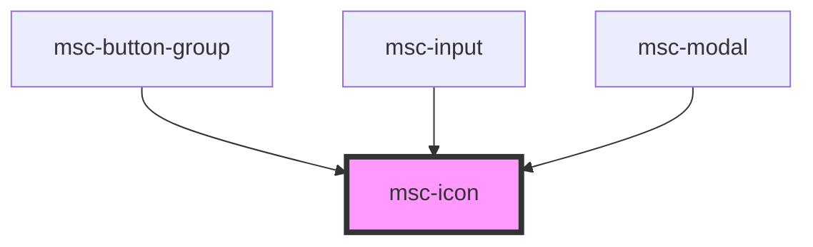

# msc-icon

<!-- Auto Generated Below -->

## Properties

| Property | Attribute | Description                                                                                                   | Type     | Default     |
| -------- | --------- | ------------------------------------------------------------------------------------------------------------- | -------- | ----------- |
| `name`   | `name`    | The iconName to resolve. This is dependant on how you declared your own IconSet.                              | `string` | `undefined` |
| `set`    | `set`     | The IconSet to pick the icon-name from. If not provied, the `defaultIconSet` is used from ApplicationService. | `string` | `undefined` |

## Dependencies

### Used by

 - [msc-button-group](../msc-button-group)
 - [msc-input](../msc-input)
 - [msc-modal](../msc-modal)

### Graph

----------------------------------------------

*Built with [StencilJS](https://stenciljs.com/)*
