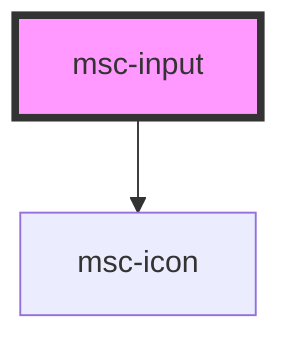

# msc-input

<!-- Auto Generated Below -->

## Properties

| Property       | Attribute      | Description                                                                        | Type                                                                                                                                                                       | Default               |
| -------------- | -------------- | ---------------------------------------------------------------------------------- | -------------------------------------------------------------------------------------------------------------------------------------------------------------------------- | --------------------- |
| `autocomplete` | `autocomplete` | Should this input field autocomplete? Ignored for type="radio" and type="checkbox" | `"false" \| "true" \| boolean`                                                                                                                                             | `false`               |
| `disabled`     | `disabled`     | Is your input disabled?                                                            | `"false" \| "true" \| boolean`                                                                                                                                             | `undefined`           |
| `name`         | `name`         | Under what name should the value be stored inside the form?                        | `string`                                                                                                                                                                   | `undefined`           |
| `placeholder`  | `placeholder`  | The value to display when there is no value.                                       | `string`                                                                                                                                                                   | `undefined`           |
| `required`     | `required`     | Is your input required?                                                            | `"false" \| "true" \| boolean`                                                                                                                                             | `false`               |
| `type`         | `type`         | The type of input you need.                                                        | `"checkbox" \| "color" \| "date" \| "datetime" \| "email" \| "month" \| "number" \| "password" \| "radio" \| "search" \| "tel" \| "text" \| "textarea" \| "url" \| "week"` | `BaseInputTypes.Text` |
| `value`        | `value`        | The value the component has/holds.                                                 | `any`                                                                                                                                                                      | `undefined`           |

## Events

| Event       | Description                                           | Type               |
| ----------- | ----------------------------------------------------- | ------------------ |
| `userInput` | CustomEvent that dispatches when the content changes. | `CustomEvent<any>` |

## Dependencies

### Depends on

- [msc-icon](../msc-icon)

### Graph

----------------------------------------------

*Built with [StencilJS](https://stenciljs.com/)*
