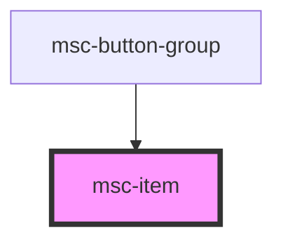

# msc-item

<!-- Auto Generated Below -->

## Properties

| Property      | Attribute     | Description                                                                                                                                                                                                                           | Type      | Default     |
| ------------- | ------------- | ------------------------------------------------------------------------------------------------------------------------------------------------------------------------------------------------------------------------------------- | --------- | ----------- |
| `active`      | `active`      |                                                                                                                                                                                                                                       | `boolean` | `undefined` |
| `href`        | `to`          | An attribute/prop that is usually exposed as "to" which intern will open the provided link when activated. Or whatever the criteria is. !IMPORTANT! To make your life easier, be sure to set the prop to "reflect" the current value! | `string`  | `undefined` |
| `interactive` | `interactive` |                                                                                                                                                                                                                                       | `boolean` | `undefined` |
| `target`      | `target`      | if an href (usually called "to" as attribute/prop) is provided, should there be a specific target type applied?                                                                                                                       | `string`  | `'_self'`   |

## Dependencies

### Used by

 - [msc-button-group](../msc-button-group)

### Graph

----------------------------------------------

*Built with [StencilJS](https://stenciljs.com/)*
