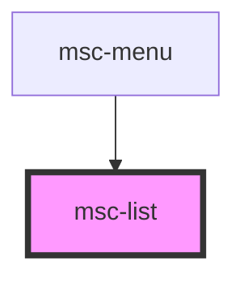

# msc-list

<!-- Auto Generated Below -->

## Properties

| Property    | Attribute   | Description | Type                         | Default     |
| ----------- | ----------- | ----------- | ---------------------------- | ----------- |
| `direction` | `direction` |             | `"horizontal" \| "vertical"` | `undefined` |
| `gap`       | `gap`       |             | `number \| string`           | `3`         |
| `reverse`   | `reverse`   |             | `boolean`                    | `undefined` |

## Dependencies

### Used by

 - [msc-menu](../msc-menu)

### Graph

----------------------------------------------

*Built with [StencilJS](https://stenciljs.com/)*
