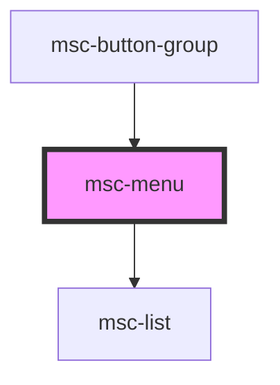

# msc-menu

<!-- Auto Generated Below -->

## Properties

| Property     | Attribute     | Description | Type                    | Default     |
| ------------ | ------------- | ----------- | ----------------------- | ----------- |
| `open`       | `open`        |             | `boolean`               | `true`      |
| `positionTo` | `position-to` |             | `HTMLElement \| string` | `undefined` |

## Events

| Event   | Description | Type               |
| ------- | ----------- | ------------------ |
| `close` |             | `CustomEvent<any>` |

## Dependencies

### Used by

 - [msc-button-group](../msc-button-group)

### Depends on

- [msc-list](../msc-list)

### Graph

----------------------------------------------

*Built with [StencilJS](https://stenciljs.com/)*
