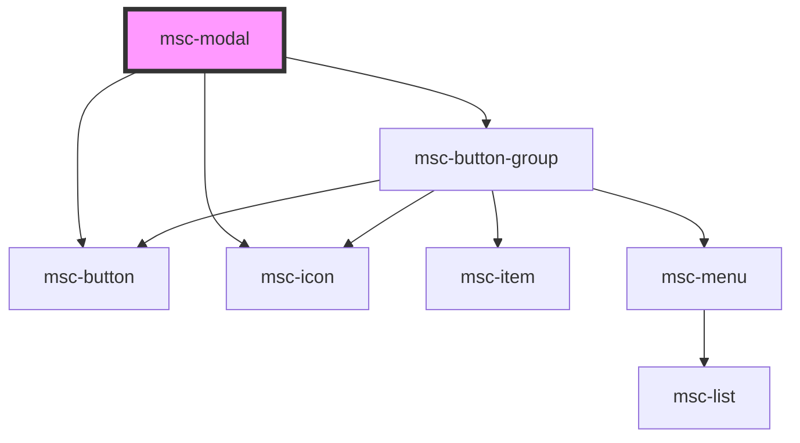

# msc-modal

<!-- Auto Generated Below -->

## Properties

| Property              | Attribute       | Description                                                                                                                                                                                                                  | Type                                   | Default     |
| --------------------- | --------------- | ---------------------------------------------------------------------------------------------------------------------------------------------------------------------------------------------------------------------------- | -------------------------------------- | ----------- |
| `closingX`            | `closing-x`     | Show's an closing-X at the top right.                                                                                                                                                                                        | `boolean`                              | `false`     |
| `displayMessage`      | `message`       | The important message you need to devliever to your user. If an array is supplied, each item will be wrapped in an paragraph.                                                                                                | `string \| string[]`                   | `undefined` |
| `displayNegativeText` | `text-negative` | If provided, this value is used to render the default, negative button. Only needed to overwrite the text, you can also overwrite the whole button if you define "data-negative" as attribute inside your slot named action. | `string`                               | `undefined` |
| `displayPositiveText` | `text-positive` | If provided, this value is used to render the default, positive button. Only needed to overwrite the text, you can also overwrite the whole button if you define "data-positive" as attribute inside your slot named action. | `string`                               | `undefined` |
| `displayTitle`        | `title`         | The title to display at the top. Supply a falsy value to disclose.                                                                                                                                                           | `string`                               | `undefined` |
| `global`              | `global`        | Don't position using "absolute". Ignore parent, use position "fixed" when true.                                                                                                                                              | `boolean`                              | `undefined` |
| `isVisible`           | `is-visible`    | *** DO NOT SET THIS VALUE BY HAND; THIS IS READONLY/INITIAL ASSIGNMENT *** If you're using a framework, you can set it. Otherwise, no. Call myModal.toggle() in html. Designed for JSX assignment.                           | `boolean`                              | `false`     |
| `omittedActions`      | `omit`          | Not only can you overwrite the texts and buttons that are present by default, using this prop you are also be able to exclude certain actions. E.g. Dialogs.alert() will omit the negative action.                           | `string \| string[]`                   | `[]`        |
| `onaffirm`            | --              |                                                                                                                                                                                                                              | `(...anyArgs: any[]) => any`           | `noop`      |
| `onreject`            | --              |                                                                                                                                                                                                                              | `(...anyArgs: any[]) => any`           | `noop`      |
| `role`                | `role`          | Defines the Modal-Role. Is it a dismissable alert or dialog?                                                                                                                                                                 | `"alert" \| "alertdialog" \| "dialog"` | `'dialog'`  |

## Events

| Event           | Description                                                                                                                                                                                                                     | Type               |
| --------------- | ------------------------------------------------------------------------------------------------------------------------------------------------------------------------------------------------------------------------------- | ------------------ |
| `affirm`        | Event and static prop to define what happens when the user wants to proceed. This may be the "apply", or "ok" button, it's usually also theme="primary" You can listen on this actions usinmg "affirm".                         | `CustomEvent<any>` |
| `modal-toggled` | Custom event that gets triggered whenever this instance changes it's `isVisible` property. Access the value using `detail`. Access the modal using `target`.                                                                    | `CustomEvent<any>` |
| `reject`        | Event and static prop to define what happens when the user does NOT want to proceed. This may be the "cancel", or "reset" button, it's usually is rendered with default styles. You can listen on this actions usinmg "reject". | `CustomEvent<any>` |

## Methods

### `close() => Promise<void>`

Closes the modal, even if it's already closed.

#### Returns

Type: `Promise<void>`

### `open() => Promise<void>`

Opens the modal, even if it's already open.

#### Returns

Type: `Promise<void>`

### `toggle(newState?: boolean) => Promise<void>`

Invert's the current visibillity state.
But you can also define a specific visibillity state as argument,
but might wanna try `show()` or `close()` first.

#### Returns

Type: `Promise<void>`

## Dependencies

### Depends on

- [msc-button](../msc-button)
- [msc-icon](../msc-icon)
- [msc-button-group](../msc-button-group)

### Graph

----------------------------------------------

*Built with [StencilJS](https://stenciljs.com/)*
