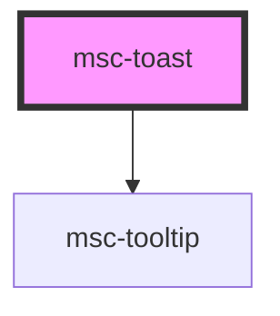

# msc-toast

<!-- Auto Generated Below -->

## Properties

| Property       | Attribute       | Description                                                                                                | Type                                                       | Default                  |
| -------------- | --------------- | ---------------------------------------------------------------------------------------------------------- | ---------------------------------------------------------- | ------------------------ |
| `dismissable`  | `dismissable`   | If true, toast will be gone when clicked.                                                                  | `boolean`                                                  | `true`                   |
| `indicator`    | `indicator`     | If true, only the most important things are rendered to make the toast work. Pure extendabillity for your! | `boolean`                                                  | `false`                  |
| `message`      | `message`       | The message to show in the Toast.                                                                          | `string`                                                   | `undefined`              |
| `messageTitle` | `message-title` | A small string that's rendered <**bold** />                                                                | `string`                                                   | `undefined`              |
| `state`        | `state`         | Visual state how the tosat looks                                                                           | `"danger" \| "info" \| "normal" \| "success" \| "warning"` | `ToastStateTypes.Normal` |
| `timeout`      | `timeout`       | How long the toast shall be visible. Use a falsy value for no timeout.                                     | `boolean \| number`                                        | `5e3`                    |

## Events

| Event   | Description                | Type               |
| ------- | -------------------------- | ------------------ |
| `close` | CLose event when dismissed | `CustomEvent<any>` |

## Methods

### `dismiss() => Promise<void>`

Removes the toast

#### Returns

Type: `Promise<void>`

## Dependencies

### Depends on

- [msc-tooltip](../msc-tooltip)

### Graph

----------------------------------------------

*Built with [StencilJS](https://stenciljs.com/)*
