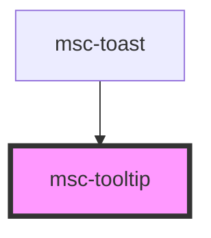

# msc-tooltip

The "tooltip" is an essential component that helps you to define a more descriptive message for another element.

It also helps you to describe icons and any other component(s) that aren't descriptive enough by default for disabled users.

ATTENTION: This component will always add itself as last element to the viewport.
This is to ensure that the tooltip is always visible in any case, additionally, it ensures that nested - scrollable views, do not conflict in the global viewport offset.

Just keep in mind that you declare the component context-based, but the component itself is rendered globally, while maintaining it's created context.

You can also overwrite the target-context by providing a "for" selector.

<!-- Auto Generated Below -->

## Properties

| Property   | Attribute  | Description                                                                                                                                                                                                                      | Type                                     | Default                |
| ---------- | ---------- | -------------------------------------------------------------------------------------------------------------------------------------------------------------------------------------------------------------------------------- | ---------------------------------------- | ---------------------- |
| `for`      | `for`      | Idenficator (id) for targeted element. Fallback to <slot/> if not provided. Tooltip will be placed relative to the found element. If the element is not found, the component will break (but a developer notice will be logged). | `string`                                 | `null`                 |
| `global`   | `global`   | **[DEPRECATED]**   All tooltips are now globally positioned by default. It's just better.                                                                                                 | `boolean`                                | `undefined`            |
| `label`    | `label`    | What should the displayed within the tooltip?                                                                                                                                                                                    | `string`                                 | `undefined`            |
| `position` | `position` | Where the actual tooltip needs to be positioned. Ignored when there is no space.                                                                                                                                                 | `"bottom" \| "left" \| "right" \| "top"` | `TooltipPositions.Top` |

## Dependencies

### Used by

 - [msc-toast](../msc-toast)

### Graph

----------------------------------------------

*Built with [StencilJS](https://stenciljs.com/)*
